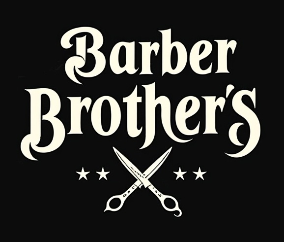
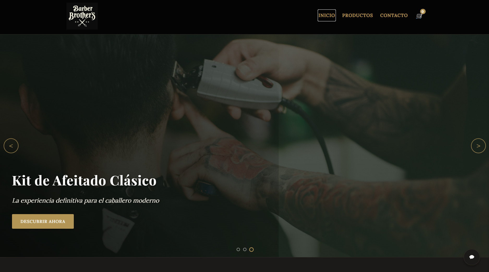

# Barbería Clásica - Website

## Descripción

Sitio web elegante para una barbería clásica con diseño luxury y vintage. Incluye catálogo de productos, carrito de compras, y gestión de contactos.

## Características

- **Diseño Elegante**: Interfaz de usuario sofisticada con estética luxury y vintage
- **Catálogo de Productos**: Visualización de productos organizados por categorías
- **Carrito de Compras**: Sistema completo para añadir productos y gestionar compras
- **Formulario de Contacto**: Permite a los clientes enviar mensajes
- **Responsive Design**: Experiencia optimizada para todo tipo de dispositivos

## Tecnologías

- **Frontend**: HTML5, CSS3, JavaScript
- **Backend**: Flask (Python)
- **Base de Datos**: PostgreSQL
- **ORM**: SQLAlchemy
- **Migraciones**: Flask-Migrate

## Estructura del Proyecto

/
├── app.py              # Aplicación principal Flask
├── models.py           # Modelos de datos SQLAlchemy
├── config.py           # Configuración y variables de entorno
├── init_data.py        # Datos de muestra para la base de datos
├── static/             # Archivos estáticos
│   ├── images/
│   └── logo.jpg
├── templates/          # Plantillas HTML
│   ├── Home.html       # Página de inicio
│   ├── productos.html  # Catálogo de productos
│   └── contacto.html   # Formulario de contacto
├── migrations/         # Historial de migraciones de la base de datos
└── .env                # Variables de entorno (no incluido en git)

## Vista Previa

