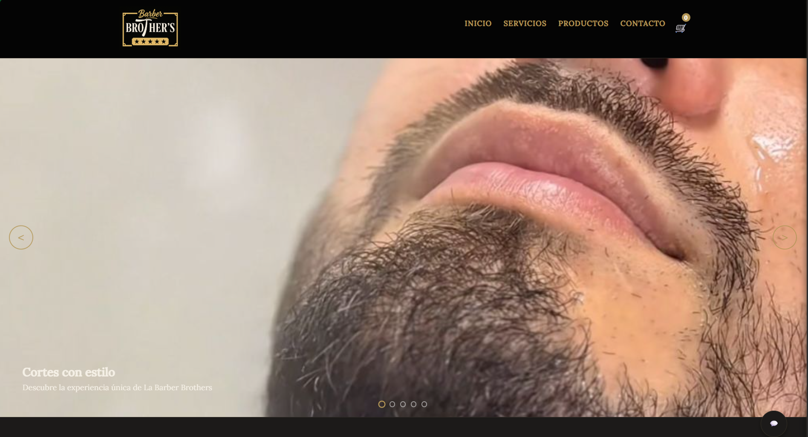

# Barber Brothers
## Descripción

Sitio web elegante para una barbería clásica con diseño luxury y vintage. Incluye catálogo de productos, carrito de compras, y gestión de contactos.

## Vista Previa

## Características

- **Diseño Elegante**: Interfaz de usuario sofisticada con estética luxury y vintage
- **Catálogo de Productos**: Visualización de productos organizados por categorías
- **Carrito de Compras**: Sistema completo para añadir productos y gestionar compras
- **Formulario de Contacto**: Permite a los clientes enviar mensajes
- **Responsive Design**: Experiencia optimizada para todo tipo de dispositivos

## Tecnologías

- **Frontend**: HTML5, CSS3, JavaScript
- **Backend**: Flask (Python)
- **Base de Datos**: PostgreSQL
- **ORM**: SQLAlchemy
- **Migraciones**: Flask-Migrate

